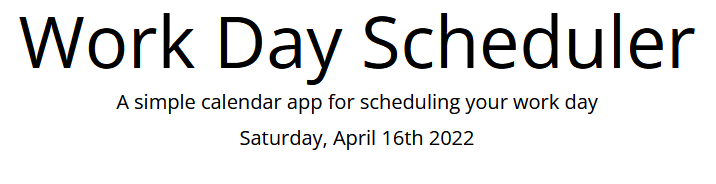
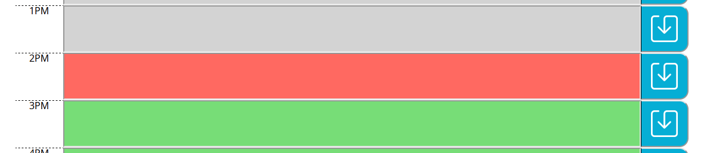
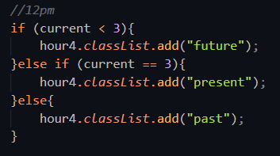

# Dwight_Day_Planner
This project is a day planner that accepts user input and saves it to local storage.

When you open the planner, the current day is displayed at the top of the calendar.

You are then presented with timeblocks for standard business hours.

Each timeblock is color coded to indicate whether it is in the past, present, or future.

When you click into a timeblock you can enter an event and save it in local storage.

When you refresh the page the saved events persist.